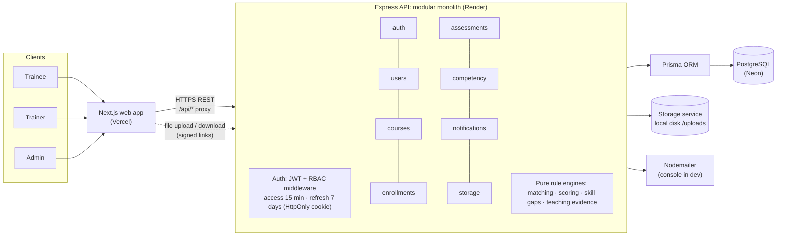

# Capacity Connect

A competency-mapped training and learning management portal for **Ministry of Earth Sciences**
institutes (IMD, INCOIS, NCPOR and others). Built for **Smart India Hackathon 2026, problem statement
SIH26075**.

Every profile, course, library item, assessment question and trainer claim is linked to **one shared
competency framework**. Because of that the system can:

1. **Rank trainers** for a subject with an explainable fit score ("why this trainer?").
2. **Report assessment results per competency** ("strong in X, weak in Y"), not just a total, and
   update the trainee's skill levels.
3. **Show the organisation's skill gaps**: trainees below the target level (demand) against trainers
   qualified to teach (supply), per station.

Verified evidence always counts more than self-declared skills. There is no AI: every number is
simple, documented arithmetic.

- Live demo: https://capacity-connect-web.vercel.app (the demo script is in [DEMO.md](DEMO.md))
- Project rules: [CLAUDE.md](CLAUDE.md)

## What each role can do

| Trainee | Trainer | Admin |
| --- | --- | --- |
| Profile: qualifications, experience, certificates, skills picked from the framework | Competency claims with evidence (certificate, qualification, experience, teaching, self-declared) | Approve/reject/disable users, change roles |
| Browse and enrol in courses; "My courses" | Create courses with modules and competency tags | Verify certificates and trainer claims |
| Library: lecture videos, slides, notes | Upload library material tagged with competencies | Review trainer applications |
| Take MCQ assessments before the deadline; per-competency results | Build assessments (each question tests one competency) | Dashboard, skill-gap view, trainer matching |
| Rate courses; apply to become a trainer | Class progress: who attempted, scores, weakest competencies; mark completions | Announcements on the homepage; audit log |

Everyone gets in-app notifications (bell) and email for enrolment, new assessments, deadlines within
24 hours, account decisions and verification results.

## Architecture



- **Layers in the API:** routes → controllers → services → Prisma. Every request body is validated
  with zod, and errors have one shape: `{ "error": { "code", "message" } }`.
- **The business rules are pure functions** in `apps/api/src/services/` (no database, no Express), so
  each rule is unit-tested on its own and reused by the seed.
- **One shared framework:** `Competency` is referenced by `SubjectRequirement`, `TrainerCompetency`,
  `UserCompetency`, `CourseCompetency`, `LibraryItemCompetency` and `Question`.

## Run it locally

Requirements: Node.js 22.12+ (24 recommended) and Docker Desktop.

```bash
npm install                                   # both apps (npm workspaces)
cp apps/api/.env.example apps/api/.env        # then set JWT_ACCESS_SECRET to a long random string
cp apps/web/.env.example apps/web/.env.local
npm run db:up                                 # PostgreSQL in Docker (host port 5433)
npm run db:migrate                            # create the tables
npm run db:seed                               # demo data; safe to re-run, resets the demo
npm run dev                                   # API on :4000 + web on :3000
```

Open http://localhost:3000 and sign in with a demo account (password `Demo@2026`, local only):

| Account | Why use it |
| --- | --- |
| `admin@moes.example` | dashboard, skill gaps, matching, verifications, announcements |
| `sanjay.iyer@imd.example` | trainer of the AWS course in the demo story |
| `pooja.menon@ncpor.example` | NCPOR Goa trainee with the AWS check-up due (see DEMO.md) |
| `aditya.sharma@imd.example` | trainee: assessment due, not yet in the ocean course |
| `meera.kulkarni@imd.example`, `priya.nair@incois.example` | trainers with rich courses |
| `zoya.qureshi@imd.example` | pending registration (for the approval demo) |

These public passwords only work on a local database; the live site uses a private one.

| Script (repo root) | What it does |
| --- | --- |
| `npm run dev` | API (watch mode) and web together |
| `npm test` | 200+ API unit and route tests (needs `npm run db:up`) |
| `npm run typecheck` / `npm run lint` | TypeScript and ESLint, both apps |
| `npm run build` | production build of both apps |
| `npm run db:seed` | load or reset the demo data |
| `npm run routes -w apps/api` | print every API route with its auth, role and validation |

## How the trainer matching score works

A **subject** (for example *AWS Installation and Calibration*) lists the competencies it needs, each
with a **minimum level** (1 Aware, 2 Working, 3 Proficient, 4 Expert) and a **weight**. The weights
of one subject add up to 1.

A **trainer** claims competencies at a level, with evidence. The evidence decides how much the claim
is trusted:

| Evidence | Trust |
| --- | --- |
| Certificate or qualification **verified by an admin** | 1.0 |
| Work experience, teaching record (including good course feedback, see below) | 0.8 |
| Self-declared, or a certificate still waiting for verification | 0.5 |
| No claim | 0 |

For every requirement:

```
coverage     = min(trainer level ÷ required level, 1) × trust
contribution = weight × coverage
fit score    = sum of all contributions          (shown as a percentage)
```

- Being **above** the required level does not add extra points (the level ratio is capped at 1).
- A trainer with **no claim at all** for a required competency is marked **partial fit**.
- If a trainer has several pieces of evidence for one competency, the best one counts.
- Ties are broken in favour of trainers who cover every requirement.

**Worked example:** Sanjay Iyer for *AWS Installation and Calibration*.

| Requirement | Weight | Sanjay's claim | Trust | Coverage | Points |
| --- | --- | --- | --- | --- | --- |
| AWS Calibration, min L3 | 0.50 | L4, work experience | 0.8 | min(4/3, 1) × 0.8 = 0.80 | 0.40 |
| Data Quality Control, min L2 | 0.20 | L3, work experience | 0.8 | 0.80 | 0.16 |
| Team Leadership, min L2 | 0.20 | L3, work experience | 0.8 | 0.80 | 0.16 |
| Linux System Administration, min L1 | 0.10 | L2, self-declared | 0.5 | 0.50 | 0.05 |
| **Fit score** | | | | | **0.77 → 77%** |

If an admin verified a certificate behind his AWS claim, that row would give 0.5 × 1.0 = 0.50 and his
score would rise to 87%. That is how verified evidence counts more. The web app shows this whole
table under **"Why this trainer?"**, so every score can be checked by hand.

Code: `apps/api/src/services/matching/matching.ts` (with 25 unit tests).

### The other rules

- **Teaching evidence from feedback** (`services/matching/teachingEvidence.ts`): a course with at
  least 3 ratings averaging 4.0 or more gives its trainer a teaching claim (trust 0.8) at the course's
  target level, for each competency the course builds. It is only used where it beats the trainer's
  own claim, and low ratings never reduce a score. The formula above does not change.
- **Assessment results and skill levels** (`services/assessment/scoring.ts`): each question tests
  one competency. Only competencies with at least 2 questions update a level: 80% or more gives L3,
  50–79% L2, below 50% L1. A multiple-choice test never awards L4 and never lowers a level set by an
  admin.
- **Skill gaps** (`services/skillGap/skillGap.ts`):
  - **Demand** is trainees whose level is below the competency's target level. Trainees with no
    record count as "not assessed".
  - **Supply** is trainers at or above the teaching bar (the highest level any subject requires)
    with trust of at least 0.8. Self-declared claims don't count.
  - **Ranking:** gaps with no qualified trainer come first, then the most trainees per qualified
    trainer.

## Security

- **Sessions:** passwords are hashed with bcrypt. The access token (15 min) lives only in memory. The
  refresh token (7 days) is a random value stored hashed in the database and sent in an
  `HttpOnly; Secure; SameSite=Lax` cookie. It is rotated on every use, and reusing an old one logs
  the user out everywhere.
- **Access control:** roles are enforced on the server for every route. `tests/security.test.ts`
  checks all 84 routes: only 7 are public, every write route validates its body, admin areas are
  admin-only, and every protected route really answers 401 without a token.
- **Login protection:** at most 10 failed logins per account per 15 minutes, plus a per-IP limit.
  Helmet security headers are on, and CORS allows only the web origin.
- **Files:** uploads are checked by extension, declared type and file content. Files are served only
  through short-lived signed links.
- **Audit log:** approvals, role changes, verifications, applications, course and announcement
  changes are all recorded; admins can read it on the Audit log page. Users are never deleted, only
  disabled, so history is kept.
- **Accessibility:** checked with axe-core (WCAG 2.1 AA) on 30 pages at phone and desktop sizes, and
  the main flows were walked with the keyboard only.

## Deployment (free tier)

```
Browser ──> Vercel (Next.js web) ──/api/* proxy──> Render (Express API) ──> Neon (Postgres)
```

The browser only talks to the Vercel site; Next.js forwards `/api/*` to Render. That keeps the
refresh cookie first-party, which Safari needs.

1. **Neon** (database): create a project in region *AWS Asia Pacific (Singapore)*. Copy the
   connection string for the **direct** host (not the one with `-pooler`).
2. **Render** (API): *New → Blueprint* → this repo. It reads `render.yaml`. Set `DATABASE_URL`
   (Neon) and `CORS_ORIGINS` (the Vercel URL). `TRUST_PROXY_HOPS=2` lets rate limiting see real client
   IPs behind the two proxies. Migrations run automatically on every start.
3. **Vercel** (web): import this repo, set *Root Directory* to `apps/web`, and add one variable for
   the **Production** environment: `NEXT_PUBLIC_API_ORIGIN` = the Render URL. It is read at build
   time, so redeploy after changing it. A production build without it fails on purpose.
4. **Seed the hosted database** from your machine (the secrets stay in a gitignored file):

   ```bash
   # apps/api/.env.deploy  (gitignored)
   DATABASE_URL=postgresql://...neon.tech/neondb?sslmode=require
   SEED_ALLOW_PROD=true
   SEED_DEMO_PASSWORD=<private password, 12+ characters>
   ```

   ```bash
   npm run hosted:migrate -w apps/api   # create or update the tables on Neon
   npm run hosted:seed -w apps/api      # demo data with your private password
   ```

**Free-tier limits:**
- The API sleeps after 15 minutes idle and takes up to a minute to wake; the login page pings it
  early.
- Render's disk is wiped on restart. The demo files in `apps/api/demo-files` are restored at every
  start, but files uploaded on the live site are lost. Object storage would only need a new class
  behind the `StorageService` interface.
- Email is written to the API log; set `SMTP_*` on Render to send real mail.

## Project layout

```
apps/api/
  prisma/            schema.prisma, migrations, seed (demo data + DEMO.md scenario), demo-files/
  src/modules/       auth, users, courses, enrollments, assessments, competency, notifications, storage
  src/services/      pure rule engines: matching, assessment scoring, skill gaps, teaching evidence
  src/middleware/    requireAuth / requireRole, zod validation, error handler
  tests/             route tests (Supertest) + security and route audit
apps/web/
  app/               pages (Next.js App Router): (member) for trainees/trainers, admin/ for admins
  components/, lib/  UI pieces, API client with token refresh, shared types
```

## Notes

- npm 11 only runs dependency install scripts approved in `allowScripts` (root `package.json`).
- ESLint is pinned to 9.x because Next.js's lint rules do not support ESLint 10 yet.
